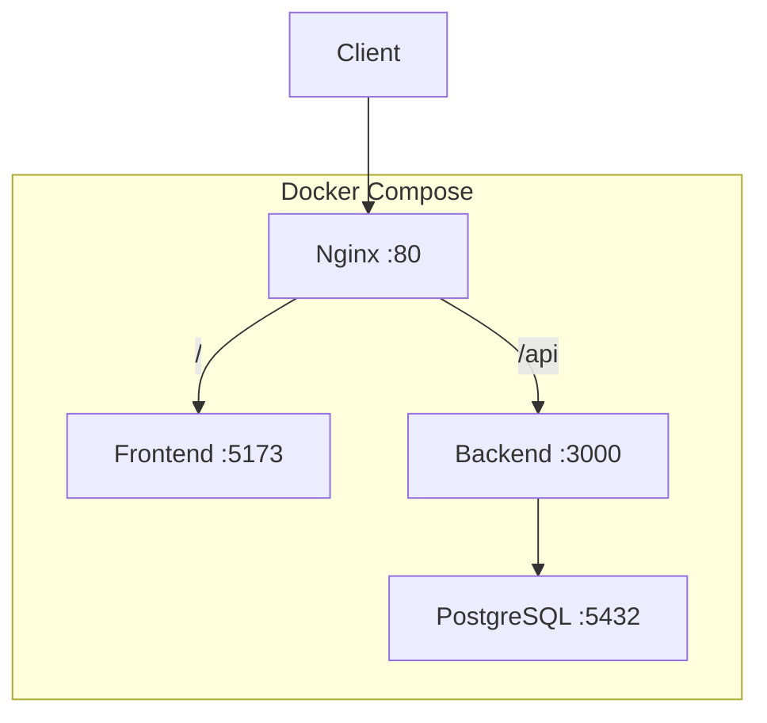
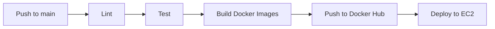

# TaskFlow — Implementation Plan

> Production-ready full-stack task management platform

---

## Current State

| Area | Status |
|------|--------|
| **Workspace** | `/home/shravani-urankar/Documents/Devops/Projects/RoadmapProjects/Taskflow` |
| **Frontend** | Vite + React 19 + TypeScript scaffolded (default template, no routing/styling yet) |
| **Backend** | `package.json` with Express 5, Prisma, Helmet, CORS, Zod, Morgan installed. No source code yet. |
| **Database** | Not configured |
| **DevOps** | Nothing set up |

---

## Architecture Overview



---

## Phase 1 — Backend Foundation

> **Goal**: Express server with TypeScript, structured folders, middleware, and health check.

### 1.1 Project Setup

- Add TypeScript & dev dependencies (`typescript`, `ts-node`, `tsx`, `@types/express`, `@types/cors`, `@types/morgan`, `prisma`)
- Add `tsconfig.json`
- Add scripts: `dev`, `build`, `start`, `prisma:migrate`, `prisma:seed`
- Create `.env.example` with `DATABASE_URL`, `PORT`, `NODE_ENV`, `CORS_ORIGIN`

### 1.2 Folder Structure

```
backend/
├── prisma/
│   ├── schema.prisma
│   ├── seed.ts
│   └── migrations/
├── src/
│   ├── index.ts              # Entry point
│   ├── app.ts                # Express app setup
│   ├── config/
│   │   └── env.ts            # Env variable loader + validation
│   ├── middleware/
│   │   ├── errorHandler.ts
│   │   ├── notFound.ts
│   │   ├── requestLogger.ts
│   │   └── validateRequest.ts
│   ├── routes/
│   │   ├── index.ts          # /api/v1 router
│   │   └── todo.routes.ts
│   ├── controllers/
│   │   └── todo.controller.ts
│   ├── services/
│   │   └── todo.service.ts
│   ├── validators/
│   │   └── todo.validator.ts  # Zod schemas
│   ├── lib/
│   │   └── prisma.ts          # Prisma client singleton
│   └── types/
│       └── index.ts
├── .env.example
├── tsconfig.json
├── package.json
└── Dockerfile
```

### 1.3 Middleware Stack (in `app.ts`)

1. `helmet()` — security headers
2. `cors()` — configurable origin
3. `express.json()` — body parser
4. `morgan("dev")` — request logging
5. `rateLimit()` — 100 req/15min window
6. Routes → `/api/v1`
7. `notFound` middleware
8. `errorHandler` middleware

### 1.4 Health Check

- `GET /api/v1/health` → `{ status: "ok", uptime, timestamp }`

### ✅ Acceptance Criteria
- Server starts with `npm run dev`
- Health check responds 200
- Error handler catches and formats errors
- Rate limiting active

---

## Phase 2 — Database & API

> **Goal**: Prisma schema, migrations, seed data, full CRUD API.

### 2.1 Prisma Schema

```prisma
model Todo {
  id          String   @id @default(uuid())
  title       String
  description String?
  status      Status   @default(PENDING)
  priority    Priority @default(MEDIUM)
  category    String?
  dueDate     DateTime?
  createdAt   DateTime @default(now())
  updatedAt   DateTime @updatedAt
}

enum Status {
  PENDING
  IN_PROGRESS
  COMPLETED
}

enum Priority {
  LOW
  MEDIUM
  HIGH
}
```

### 2.2 API Endpoints

| Method | Endpoint | Description |
|--------|----------|-------------|
| GET | `/api/v1/todos` | List all (with query filters: status, priority, category, search, sort) |
| POST | `/api/v1/todos` | Create todo |
| GET | `/api/v1/todos/:id` | Get single todo |
| PUT | `/api/v1/todos/:id` | Update todo |
| DELETE | `/api/v1/todos/:id` | Delete todo |
| GET | `/api/v1/todos/stats` | Dashboard statistics |

### 2.3 Query Parameters for GET `/todos`

- `status` — filter by status enum
- `priority` — filter by priority enum
- `category` — filter by category string
- `search` — search title/description
- `sortBy` — field name (default: `createdAt`)
- `sortOrder` — `asc` | `desc` (default: `desc`)

### 2.4 Zod Validation Schemas

- `createTodoSchema` — title required, optional description/status/priority/category/dueDate
- `updateTodoSchema` — all fields optional
- `queryTodoSchema` — validate query params

### 2.5 Seed Data

- 15-20 sample todos across all statuses, priorities, and categories
- Categories: `Work`, `Personal`, `Health`, `Learning`, `Finance`

### ✅ Acceptance Criteria
- All 6 endpoints working via Postman/curl
- Filters, search, and sort functional
- Stats endpoint returns correct counts
- Validation errors return 400 with descriptive messages
- Seed data populates correctly

---

## Phase 3 — Frontend Foundation & Design System

> **Goal**: Tailwind setup, routing, layout shell, design tokens, reusable components.

### 3.1 Install Dependencies

```
# Core
react-router-dom @tanstack/react-query axios

# Styling
tailwindcss @tailwindcss/vite

# UI Extras
lucide-react react-hot-toast framer-motion recharts
```

### 3.2 Folder Structure

```
frontend/src/
├── api/
│   ├── axios.ts           # Axios instance
│   └── todos.ts           # API functions
├── components/
│   ├── layout/
│   │   ├── Sidebar.tsx
│   │   ├── Topbar.tsx
│   │   └── AppLayout.tsx
│   ├── ui/
│   │   ├── Button.tsx
│   │   ├── Card.tsx
│   │   ├── Modal.tsx
│   │   ├── Badge.tsx
│   │   ├── Input.tsx
│   │   ├── Select.tsx
│   │   ├── Skeleton.tsx
│   │   ├── EmptyState.tsx
│   │   ├── ConfirmDialog.tsx
│   │   └── ThemeToggle.tsx
│   ├── todos/
│   │   ├── TodoCard.tsx
│   │   ├── TodoForm.tsx
│   │   ├── TodoFilters.tsx
│   │   └── TodoList.tsx
│   └── dashboard/
│       ├── StatCard.tsx
│       ├── ProgressChart.tsx
│       └── RecentTasks.tsx
├── hooks/
│   ├── useTodos.ts        # TanStack Query hooks
│   └── useTheme.ts
├── pages/
│   ├── Dashboard.tsx
│   ├── Tasks.tsx
│   ├── Analytics.tsx
│   ├── Settings.tsx
│   └── NotFound.tsx
├── lib/
│   └── utils.ts
├── types/
│   └── index.ts
├── App.tsx
├── main.tsx
└── index.css
```

### 3.3 Design System (in `index.css` via Tailwind)

- **Dark mode**: `class` strategy, CSS variables for colors
- **Color palette**: Indigo/violet primary, slate neutrals, semantic colors for status/priority
- **Typography**: Inter font from Google Fonts
- **Effects**: Glassmorphism cards (`backdrop-blur`, translucent bg), subtle shadows, gradient accents
- **Animations**: Fade-in, slide-up, scale on hover (via Framer Motion)

### 3.4 Layout Shell

- **Sidebar**: Logo, navigation links (Dashboard, Tasks, Analytics, Settings), collapsible on mobile
- **Topbar**: Page title, search bar, theme toggle, mobile menu button
- **Main content**: Scrollable area with max-width container

### ✅ Acceptance Criteria
- App renders with sidebar + topbar layout
- All 6 routes navigate correctly
- Dark/light toggle works and persists to localStorage
- Responsive: sidebar collapses to hamburger on mobile
- UI components render with consistent styling

---

## Phase 4 — Frontend Features

> **Goal**: Full task CRUD, dashboard, analytics, settings, all UX enhancements.

### 4.1 Dashboard Page

- 4 stat cards: Total, Completed, Pending, Overdue (with icons + color coding)
- Progress ring/bar showing completion percentage
- Recent tasks list (last 5)
- Tasks by priority bar chart (Recharts)

### 4.2 Tasks Page

- Filter bar: status, priority, category dropdowns + search input
- Sort dropdown (date, priority, title)
- Task cards in grid/list view with:
  - Title, description preview, status badge, priority badge, category tag, due date
  - Hover: reveal edit/delete actions
  - Click checkbox: toggle complete (optimistic update)
- "Create Task" button → opens modal
- Empty state when no tasks match filters

### 4.3 Create/Edit Task Modal

- Form fields: title, description (textarea), status, priority, category, due date
- Zod validation on client
- Submit → POST or PUT via TanStack Mutation
- Optimistic update + toast on success/error

### 4.4 Analytics Page

- Tasks by status (pie/donut chart)
- Tasks by priority (bar chart)
- Completion trend over time (line chart — group by createdAt)
- Category distribution (horizontal bar)

### 4.5 Settings Page

- Theme toggle (dark/light)
- App info / version
- Placeholder for future settings (notifications, profile)

### 4.6 UX Enhancements

| Feature | Implementation |
|---------|---------------|
| Skeleton loading | `Skeleton.tsx` shown while queries load |
| Empty states | Illustrated empty state per page |
| Confirm dialogs | Before delete actions |
| Toast notifications | `react-hot-toast` on CRUD success/error |
| Optimistic updates | TanStack Query `onMutate` / `onError` rollback |
| Smooth transitions | Framer Motion `AnimatePresence` on page/modal transitions |

### ✅ Acceptance Criteria
- Full CRUD from UI: create, read, update, delete tasks
- Dashboard stats match actual data
- Filters, search, sort all work
- Charts render with real data
- All UX enhancements functional
- Fully responsive on mobile

---

## Phase 5 — Containerization

> **Goal**: Docker setup for all 4 services + Docker Compose.

### 5.1 File Structure

```
Taskflow/
├── docker-compose.yml
├── nginx/
│   └── nginx.conf
├── frontend/
│   └── Dockerfile
├── backend/
│   └── Dockerfile
└── .env.example
```

### 5.2 Backend Dockerfile (multi-stage)

```dockerfile
# Stage 1: Build
FROM node:20-alpine AS builder
WORKDIR /app
COPY package*.json ./
RUN npm ci
COPY . .
RUN npx prisma generate
RUN npm run build

# Stage 2: Production
FROM node:20-alpine
WORKDIR /app
COPY --from=builder /app/dist ./dist
COPY --from=builder /app/node_modules ./node_modules
COPY --from=builder /app/prisma ./prisma
COPY --from=builder /app/package.json ./
EXPOSE 3000
CMD ["sh", "-c", "npx prisma migrate deploy && node dist/index.js"]
```

### 5.3 Frontend Dockerfile (multi-stage)

```dockerfile
# Stage 1: Build
FROM node:20-alpine AS builder
WORKDIR /app
COPY package*.json ./
RUN npm ci
COPY . .
RUN npm run build

# Stage 2: Serve with Nginx
FROM nginx:alpine
COPY --from=builder /app/dist /usr/share/nginx/html
COPY nginx-spa.conf /etc/nginx/conf.d/default.conf
EXPOSE 80
```

### 5.4 Nginx Config (`nginx/nginx.conf`)

- Listen on port 80
- `location /` → proxy to frontend container
- `location /api` → proxy to backend container
- Gzip compression, security headers, caching for static assets

### 5.5 Docker Compose

```yaml
services:
  postgres:
    image: postgres:16-alpine
    volumes: [pgdata:/var/lib/postgresql/data]
    environment: [POSTGRES_DB, POSTGRES_USER, POSTGRES_PASSWORD]
    
  backend:
    build: ./backend
    depends_on: [postgres]
    environment: [DATABASE_URL, NODE_ENV]
    
  frontend:
    build: ./frontend
    
  nginx:
    image: nginx:alpine
    ports: ["80:80"]
    depends_on: [frontend, backend]
    volumes: [./nginx/nginx.conf:/etc/nginx/nginx.conf]

volumes:
  pgdata:
```

### ✅ Acceptance Criteria
- `docker compose up --build` starts all 4 containers
- App accessible at `http://localhost`
- API accessible at `http://localhost/api/v1/health`
- DB data persists across restarts
- Containers are small (multi-stage builds)

---

## Phase 6 — Infrastructure & Configuration Management

> **Goal**: Terraform for AWS infra, Ansible for server setup.

### 6.1 File Structure

```
Taskflow/
├── terraform/
│   ├── main.tf
│   ├── variables.tf
│   ├── outputs.tf
│   ├── provider.tf
│   └── terraform.tfvars.example
├── ansible/
│   ├── inventory.ini
│   ├── playbook.yml
│   └── roles/
│       └── docker/
│           └── tasks/main.yml
```

### 6.2 Terraform Resources

| Resource | Purpose |
|----------|---------|
| `aws_vpc` | VPC with DNS support |
| `aws_subnet` | Public subnet |
| `aws_internet_gateway` | Internet access |
| `aws_route_table` | Route to IGW |
| `aws_security_group` | Ports: 22 (SSH), 80 (HTTP), 443 (HTTPS) |
| `aws_instance` | Ubuntu 22.04 EC2 (t2.micro or t3.small) |
| `aws_key_pair` | SSH key for access |

### 6.3 Ansible Playbook Tasks

1. Update & upgrade apt packages
2. Install Docker & Docker Compose plugin
3. Add ubuntu user to docker group
4. Copy `docker-compose.yml` and configs to server
5. Pull Docker images from Docker Hub
6. Run `docker compose up -d`
7. Verify health check endpoint

### ✅ Acceptance Criteria
- `terraform apply` creates EC2 with correct security groups
- `ansible-playbook` configures server and deploys app
- App accessible via EC2 public IP

---

## Phase 7 — CI/CD Pipeline

> **Goal**: GitHub Actions pipeline for lint, test, build, push, deploy.

### 7.1 Workflow File

```
.github/workflows/deploy.yml
```

### 7.2 Pipeline Stages



| Stage | Details |
|-------|---------|
| **Lint** | Run `npm run lint` in both frontend & backend |
| **Test** | Run `npm test` (unit tests if present) |
| **Build** | `docker build` for frontend & backend |
| **Push** | Push to Docker Hub with `latest` + commit SHA tags |
| **Deploy** | SSH into EC2 → `docker compose pull && docker compose up -d` |

### 7.3 GitHub Secrets Required

- `DOCKERHUB_USERNAME`, `DOCKERHUB_TOKEN`
- `EC2_HOST`, `EC2_SSH_KEY`, `EC2_USERNAME`

### ✅ Acceptance Criteria
- Push to `main` triggers full pipeline
- Images pushed to Docker Hub
- EC2 updated with new images automatically

---

## Documentation & Final Polish

### README.md (root)

- Project overview & screenshots
- Architecture diagram
- Tech stack
- Local development setup (with Docker)
- Manual setup (without Docker)
- API documentation table
- Environment variables reference
- Deployment guide
- Contributing guidelines

### Additional Files

- `backend/.env.example`
- `frontend/.env.example`
- Root `.env.example` (for Docker Compose)
- `API.md` — detailed API docs with request/response examples
- `.dockerignore` files for both services

---

## Execution Order Summary

| Phase | Focus | Estimated Effort |
|-------|-------|-----------------|
| **1** | Backend foundation (TypeScript, middleware, health check) | Medium |
| **2** | Database schema, CRUD API, seed data | Medium |
| **3** | Frontend foundation (Tailwind, routing, layout, design system, UI components) | Large |
| **4** | Frontend features (CRUD, dashboard, analytics, UX) | Large |
| **5** | Docker containers & Compose | Medium |
| **6** | Terraform + Ansible | Medium |
| **7** | GitHub Actions CI/CD | Small |

> [!IMPORTANT]
> Phases 1-2 (backend) and Phase 3 (frontend foundation) can be built in parallel once the API contract is agreed upon. Phases 5-7 (DevOps) depend on a working app from Phases 1-4.
